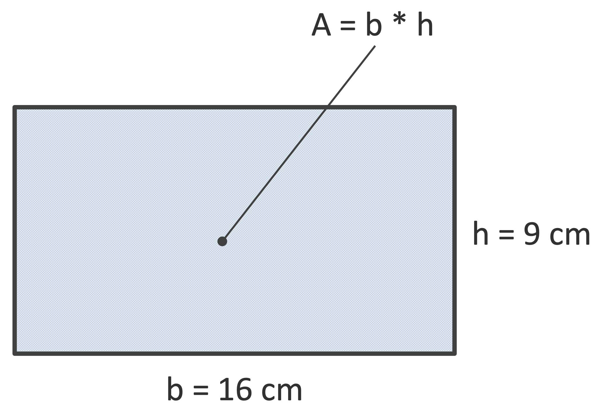
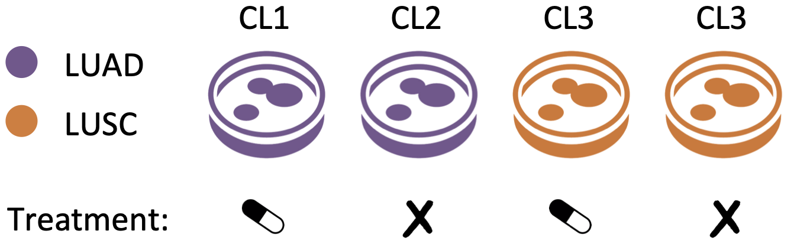

# Introduction

In this exercise set, you will practice the basic building blocks of R programming. The topics include variables, data types, calculations, logical checks, vectors, factors, matrices, lists, and data frames. You will also learn how to name elements, create sequences, examine the structure of objects, and load and explore data from external files.

# Exercises

## Exercise 1

Save the length of the base and heigth of the rectangle depicted above into two numeric variables called, respectively, `base` and `height`.

{fig-align="center" width="80%"}

Compute the area of the rectangle by using these variables and save it into a numeric variable called `area`.

Check if the area is bigger than 100 cm\^2.

## Exercise 2

```{r}
Name <- "Maria"
Age <- "20"
PhD <- "TRUE"
```

❓ **Question:** What is the class of the variables below?

1.  *Name*: character; *Age*: numeric; *PhD*: character
2.  *Name*: character; *Age*: character; *PhD*: character
3.  *Name*: character; *Age*: numeric; *PhD*: logical
4.  None of the above

<details>

<summary>Click to see the answer</summary>

**Answer:** 2. *Name*: character; *Age*: character; *PhD*: character

</details>

## Exercise 3

```{r}
x <- 5
y <- 0
z <- x/y
```

❓ **Question:** What is the value of the variable `z` above?

1.  -Inf
2.  NA
3.  NaN
4.  None of the above

<details>

<summary>Click to see the answer</summary>

**Answer:** 1. -Inf

</details>

## Exercise 4

```{r}
x <- c("a", "b", "c")
y <- seq(1,10)
z <- c(x,y)
```

❓ **Question:** What is the class of the *z* vector above?

1.  Character and numeric
2.  Numeric
3.  Character
4.  NA

<details>

<summary>Click to see the answer</summary>

**Answer:** 3. Character

</details>

## Exercise 5

Build a numeric vector containing all even numbers between 0 and 100 (extremes included), and save it into a variable called `even_vec`.

## Exercise 6

Initialize a matrix with 2 rows and 3 columns that has all `1` on the first row and all `2` on the second row.

Give it column and row names as you wish.

Check its dimensions, i.e., number of rows and columns; can you do this in different ways?

## Exercise 7

Initialize a numeric vector to store the year in which you got your driving licence and the year you got your first car (`NA` values are possible). Assign appropriate names to the vector elements.

Initialize a second vector, of characters, to store the names of your favorite cities in Europe (as many as you like).

Save both vectors in a named list using meaningful names.

## Exercise 8

Imagine you have an experiment with 4 lung cancer cell lines: 2 from lung adenocarcinomas (LUAD) and 2 from lung squamous cell carcinoma (LUSC).

One cell line from each cancer subtype was treated with a drug, the other one was untreated, as shown in the figure below:

{fig-align="center" width="80%"}

Creat a data.frame the store the info about the experiment. Precisely, we should have a row for each samples, and the following columns: cell line identifier (i.e., "CL1", "CL2", ...), lung-cancer subtype, treatment.

Check how many rows and columns the data.frame has.

## Exercise 9

Create the following two sequences (object `y1` and `y2`) using the `seq` function:

```{r, echo = FALSE, include=TRUE}
(y1 <- seq(from = 6,  to = 10, by = 0.5))
(y2 <- seq(from = 10, to = 6,  by = -0.5))
```

You might have noticed that `y2` is the *reversed* version of `y1`. Create `y2` directly from `y1` using the `rev` function.

## Exercise 10

Create the following objects:

```{r, echo = FALSE, include=TRUE}
(x <- c(name = "Alex", surname = "White"))
(y <- c(red = FALSE, green = TRUE, blue = FALSE))
(z <- c(age = 27, height = 183, weight = 73, gender = "male"))
```

Check their lengths: are they correct?

## Exercise 11

Load the "bmi.rds" file from the "Data" directory using `readRDS` (the full path is `../Data/bmi.rds`), and save it to a variable calles `info`. This file contains information regarding the weigth in kg and height in m of a group of people.

Check the class of the imported object.

Check its dimensions, i.e., number of rows and columns.

Have a look at the content using `head` and `tail`. Why do you get the same output?

What are the column names?
