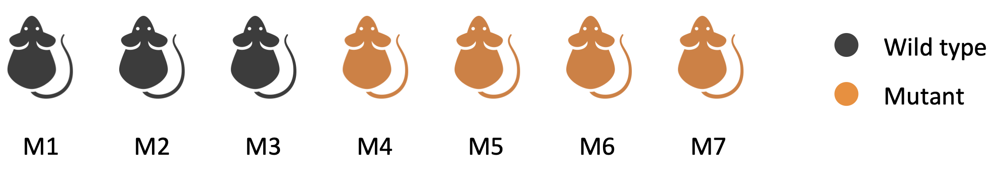

# Introduction

TBA

# Exercises

## Exercise 1

Create the following vector:

```{r}
x <- c(0, -1, 3, 10, -14, 7.5, 9)
```

Save in vector `y` only the non-negative elements of the vector `x` using:

-   Negative indexes
-   Positive indexes
-   A logical vector
-   A logical condition based on `>` or `≤`

## Exercise 2

Create the following vector:

```{r}
gene_exp <- c(CD8A = 10.2, CD8B = 11.4, PDCD1 = 4.0)
```

Check the length and the names of the vector `gene_exp` above.

Access the expression of the CD8A and CD8B genes using:

- Positive indexes
- Vector names

## Exercise 3

❓ **Question:** Without executing the code below, which is the length of vector `z`?

```{r}
y <- c(11, 12, -4, 7, 0)
z <- y>0
```

1.  3
2.  4
3.  5
4.  None of the above

<details>

<summary>Click to see the answer</summary>

**Answer:** 3. 5

</details>

## Exercise 4

Create the following vector called `cell_fractions`:

```{r}
cell_fractions <- c(-0.1, 0.4, -0.4, 0.5, 0.2)
```

Set to 0 all negative cell fractions, overwriting the original vector.

## Exercise 5

Create the following matrix:

```{r, echo=TRUE}
M <- matrix(1:6, nrow = 3, byrow = FALSE) 
colnames(M) <- c("Sample_A", "Sample_B")
rownames(M) <- c("Gene1", "Gene2", "Gene3")
```

Save the second row of the `M` matrix in:

- A vector called `v`
- A 1x2 matrix called `N`

Try to use both:

- A numeric index
- The matrix row names

## Exercise 6

Have a look at the code below **without** executing it in R

```{r, echo=TRUE}
DF <- data.frame(name = c("Mary", "John"),
                 age = c(19, 30))
x <- DF[,"name"]
```

❓ **Question:** What is the class of `x`?

1.  Character
2.  Numeric
3.  Factor
4.  Logical

<details>

<summary>Click to see the answer</summary>

**Answer:** 1. Character

</details>

## Exercise 7

Load again the "bmi.rds" file from the "Data" directory and save it in a variable called `info`.

Use the `weight` and `height` columns to compute the body max index (BMI) according to the following formula, and save it in a new column in the `info` data.frame called `bmi` (i.e., `info[, "bmi"]` or `info$bmi`):

$$
BMI = \frac{\text{weight in kg}}{(\text{height in m})^2}
$$
The updated `info` data.frame shoudl look like this:

```{r, include=TRUE, echo=FALSE}
info <- readRDS("../../Data/bmi.rds")
info[,"bmi"] <- info[,"weight"] / info[,"height"]^2
print(info)
```

Save the updated `info` data.frame in a local directory (not "Data" directory, where you do not have writing access), in the form of .RDS file called "info_w_bmi.rds").

## Exercise 8

Build the following vectors:

```{r, include=FALSE, echo=TRUE}
v1 <- seq(0, 100, 5)
v2 <- c(10, -2, 0, 5)
v3 <- c(TRUE, TRUE, FALSE, FALSE, FALSE)

```

What is the length of `v1`, `v2`, and `v3`?

Which results do you get if you sum up the elements of `v1`? And for `v2` and `v3`? How would you interpret the results obtained for `v3`?

How can we sort the elements of `v2` from the smallest to the largest? What do we obtain instead if we use `order(v2)`?

## Exercise 9

Create the following vectors:

```{r, echo = TRUE}
a <- c(TRUE, TRUE, TRUE)
b <- c(FALSE, TRUE, TRUE)
c <- c(FALSE, FALSE, TRUE)
d <- c(1.1, 2.2)
e <- c(100, 200)
f <- c(-500, 500)
```

Now lets use row and/or column binding to create the following matrices:

```{r, echo = FALSE}
print(cbind(a, b, c))
```

```{r, echo = FALSE}
print(rbind(a, b, c))
```

```{r, echo = FALSE}
print(cbind(X = d, Y = e, Z = f))
```


## Exercise 10

Let's define the following vectors:

```{r, echo = TRUE}
x <- c(-1, 1, 3, 7, 23)
y <- c(-2, -1, 0)
```

Find the elements that are present in both `x` and `y`.

Find the elements that are present only in `x`.

Check if `-2` is present in `x`. Do the same for `y`.

Define a new vector called `z`, which contains all elements of `x` and `y`.

## Exercise 11

Consider that some RNA-seq data was generated from some mice as illustrated below:

{fig-align="center" width="80%"}

Build a vector of factors storing the information about which mice is wild type ("WT") or mutant ("MU") (use `rep`).

Add names to the vector elements to save the mouse identifiers (i.e., "M1", "M2", "M3", ...).

Apply the `table` function to the correct column to count how many "WT" and "MU" mice there are.
